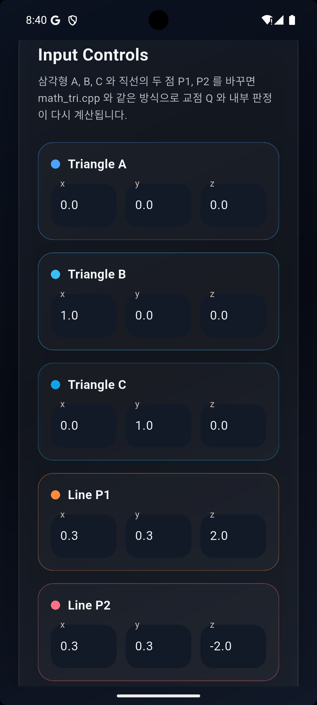
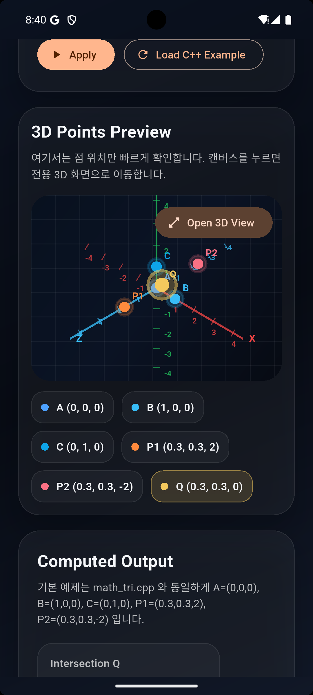
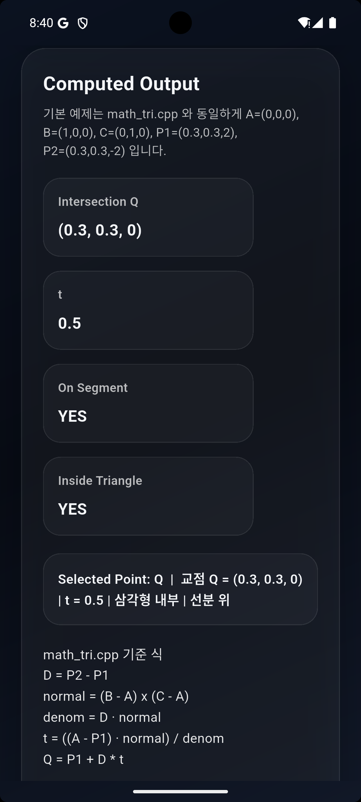
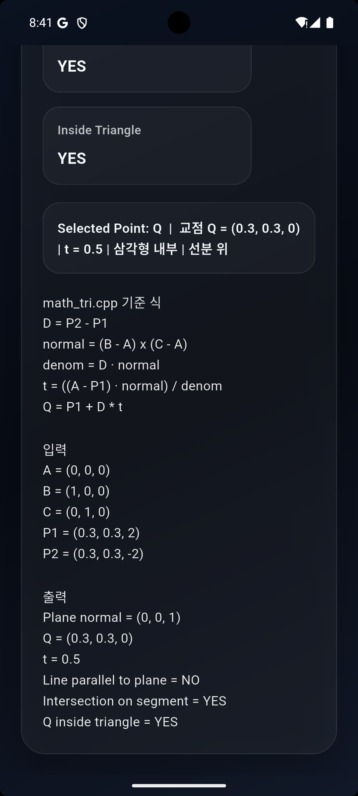
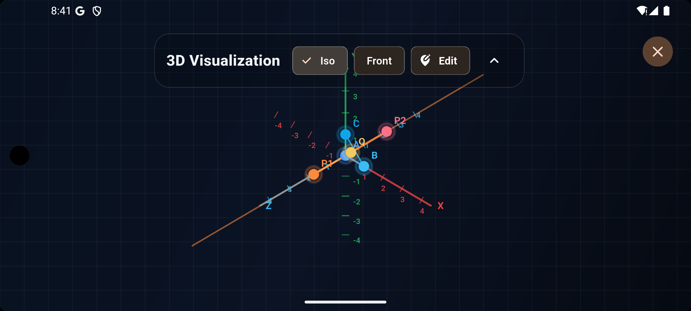
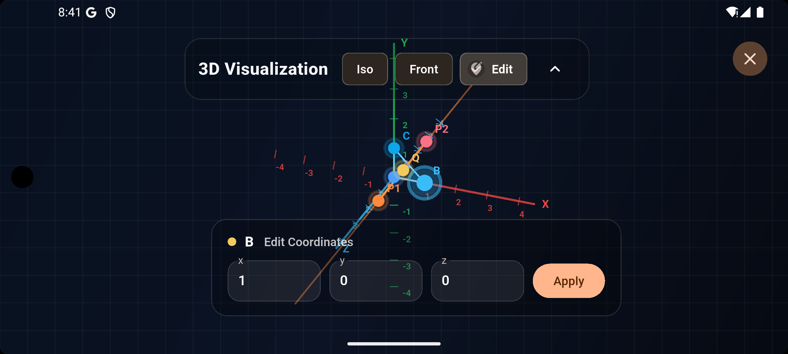

# Tri Vector

Flutter 기반 3D Geometry Visualizer 프로젝트입니다.  
삼각형 `A, B, C` 와 직선 `P1, P2` 를 입력받아 교점 `Q` 를 계산하고, 결과를 3D 화면과 수식 카드로 확인할 수 있습니다.

## 주요 기능

- 삼각형과 직선의 교점 계산
- `math_tri.cpp` 로직을 Dart 계산 엔진으로 이식
- 메인 화면에서 입력값 수정 및 결과 확인
- 3D 프리뷰 화면 제공
- 전용 3D 뷰어에서 `Iso`, `Front`, `Edit` 모드 지원
- 전용 3D 뷰어에서 점 선택, 좌표 확인, 좌표 직접 수정
- 전용 3D 뷰어에서 수정한 좌표를 메인 화면에 동기화

## 스크린샷

### 1. 메인 계산 화면

입력 좌표, 3D 프리뷰, 계산 결과를 한 화면에서 확인하는 기본 작업 화면입니다.



### 2. 입력과 결과 확인 흐름

삼각형과 직선 좌표를 조정하면서 교점 결과가 어떻게 바뀌는지 확인하는 화면입니다.



### 3. 3D 프리뷰 및 전용 뷰어 진입

메인 화면에서 점 위치를 빠르게 확인하고, 전용 3D 뷰어로 이동하기 전 단계의 화면입니다.



### 4. 전용 3D 뷰어

가로 화면 기준으로 3D 장면을 크게 띄우고 `Iso`, `Front` 시점을 전환할 수 있는 전용 뷰어입니다.



### 5. 점 선택과 좌표 표시

3D 장면에서 점을 선택했을 때 하단 좌표 배지로 현재 위치를 바로 확인하는 상태입니다.



### 6. Edit 모드 좌표 수정

`Edit` 모드에서 점을 직접 드래그하거나 좌표 값을 입력해 위치를 수정하는 화면입니다.



## 실행 방법

```bash
flutter pub get
flutter run
```

릴리스 APK 생성:

```bash
flutter build apk --release
```

생성 경로:

```text
build/app/outputs/flutter-apk/app-release.apk
```

## 폴더 구조

```text
.
├── android/                  # Android 프로젝트 설정
├── ios/                      # iOS 프로젝트 설정
├── linux/                    # Linux 데스크톱 설정
├── lib/
│   ├── main.dart             # 앱 시작점
│   ├── math_tri.cpp          # 원본 수학 로직 참고 파일
│   ├── models/               # 벡터, 기하 계산, 뷰포트, 결과 모델
│   ├── painters/             # 3D 캔버스 렌더링 로직
│   ├── screens/              # 과거 Todo 예제 화면 잔존 파일
│   └── widgets/              # 메인 UI, 프리뷰, 뷰어, 결과 카드
├── test/                     # 위젯 테스트
├── pubspec.yaml              # 의존성 및 Flutter 설정
└── README.md                 # 프로젝트 문서
```

## 주요 파일 설명

### `lib/main.dart`

- 앱 진입점
- `GeometryHomePage` 를 루트 화면으로 사용

### `lib/models/`

- `geometry_engine.dart`: 교점 계산 핵심 로직
- `geometry_view.dart`: 카메라, 투영, 화면 좌표 변환 로직
- `geometry_scene.dart`: 화면에 표시할 점 데이터 구성
- `vector3.dart`: 3차원 벡터 연산
- `geometry_result.dart`: 계산 결과 모델

### `lib/painters/`

- `geometry_painter.dart`: 축, 삼각형, 직선, 점, 선택 상태 렌더링

### `lib/widgets/`

- `geometry_home_page.dart`: 메인 입력/결과 화면
- `geometry_preview_card.dart`: 메인 화면의 3D 프리뷰
- `geometry_viewer_page.dart`: 전용 전체화면 3D 뷰어
- `geometry_canvas_card.dart`: 공용 3D 캔버스 카드
- `geometry_control_panel.dart`: 좌표 입력 폼
- `geometry_results_card.dart`: 계산 결과 및 선택 점 정보
- `geometry_header.dart`: 상단 소개 및 액션 버튼
- `vector_input_section.dart`: 좌표 입력 섹션 구성
- `glass_card.dart`: 공통 카드 스타일

## 3D 뷰어 동작

- 프리뷰 클릭 시 전용 3D 뷰어로 이동
- 뷰어 진입 시 가로 화면 기준으로 동작
- `Iso`, `Front` 프리셋 선택 가능
- 상단 UI는 접기/펼치기 가능
- `X` 버튼은 우측 상단 고정
- 일반 모드에서는 점 선택 시 작은 좌표 배지 표시
- `Edit` 모드에서는 좌표 입력 UI와 점 드래그 편집 가능

## 테스트 / 검증

```bash
flutter analyze
flutter test
```

## 참고

- `lib/math_tri.cpp` 의 직선-평면 교차 계산 흐름을 Flutter 앱에 맞춰 이식한 프로젝트입니다.
- `lib/screens/`, `lib/models/task.dart`, `lib/models/tasks_data.dart`, `lib/widgets/tasks_*` 파일은 현재 기하 시각화 핵심 흐름과 직접 관련 없는 기존 예제 잔존 코드입니다.
